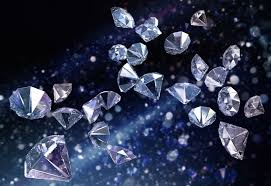

# Kaggle competition
## Diamond price predictor.

 

El objetivo de este proyecto es predecir el precio de un diamante en base al dataset facilitado para la competición de kaggle "Diamonds | datamad0820". https://www.kaggle.com/c/diamonds-datamad0820/data.

## Análisis.

Realizamos un estudio previo para conocer cuales son las características principales que determinan el precio de un diamante y los contrastamos con los datos que figuran en el dataset.

## Como se ha realizado.
 
 El primer paso ha sido realizar la limpieza y el análisis del dataset facilitado para la competición. 
 Posteriormente, para obtener la predicción, hemos dividido el proyecto en tres fases.
 
1) Filtrado de modelos, para quedarnos con aquellos modelos que devuelven mejores resultados para la métrica RMSE (Root Mean Squared Error), métrica utilizada en la competición de Kaggle. En este caso, nos quedamos con aquellos modelos cuya desviación se sitúa por debajo de los 1000$.
2) Selección del modelo definitivo, partiendo de los modelos filtrados en la primera fase, hemos seleccionado los modelos más óptimos, y los hemos enfrentado entre sí, para descubrir cual es el modelo ideal. Para ello, hemos aplicado 5 métricas diferentes para cada uno de los modelos y finalmente les hemos realizado un cross_value_score para comprobar cual de ellos, es el que obtiene un mayor porcentaje de precisión.
3) En el último paso, trabajamos ya unicamente con el modelo idóneo. En este caso, como el modelo seleccionado depende a su vez de de otros dos modelos, vamos a realizar un pequeño ánalisis por separado de cada uno de estos, de este modo, mediante el uso de GridSearchCV comprobaremos cuales son los parámetros que mejores resultados devuelven para la predicción.

Finalmente, una vez realizado todo lo anterior, exportamos nuestro nuevo dataset únicamente con las columnas id y price en formato CSV (formato requerido por la competición), y los subimos a Kaggle para obtener nuestro resultado.

Para la realización del proyecto hemos trabajado con varios modelos de regresión:

    - AdaBoostRegressor.
    - ARDRegression.
    - DecisionTreeRegressor.
    - ElasticNetCV.
    - ExtraTreesRegressor.
    - GradientBoostingRegressor.
    - HistGradientBoostingRegressor.
    - LassoCV.
    - LinearRegression.
    - MLPRegressor.
    - RandomForestRegressor.
    - Ridge.
    - RidgeCV.
    - SGDRegressor.
    - VotingRegressor.
    
También hemos trabajado con varias métricas de regresión:

    - explained_variance_score.
    - max_error.
    - mean_absolute_error.
    - r2_score
    - root mean_squared_error.
  

## Conclusión.

Se ha obtenido una predicción con una desviación de aproximadamente 520$. Esta predicción es bastante buena para los elevados precios que tienen los diamantes.

